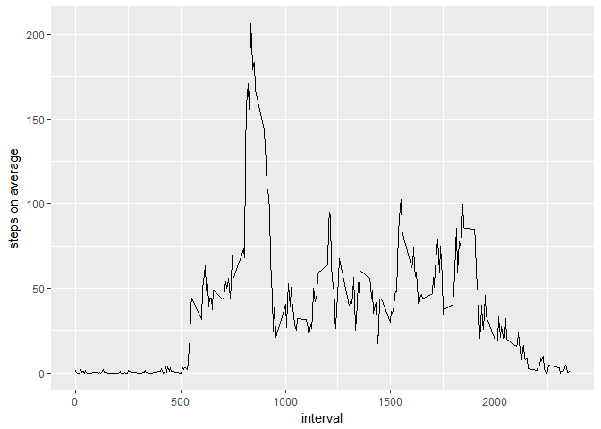

## Loading and preprocessing the data

We start by unziping the file, reading data and having a look at it


```r
unzip("activity.zip")
read.csv("activity.csv") -> activity.df
str(activity.df)
```

```
## 'data.frame':	17568 obs. of  3 variables:
##  $ steps   : int  NA NA NA NA NA NA NA NA NA NA ...
##  $ date    : Factor w/ 61 levels "2012-10-01","2012-10-02",..: 1 1 1 1 1 1 1 1 1 1 ...
##  $ interval: int  0 5 10 15 20 25 30 35 40 45 ...
```


## What is mean total number of steps taken per day?

First we create a data frame, that summarizes the number of steps by days using *dplyr* package


```r
library(dplyr)
```

```
## 
## Attaching package: 'dplyr'
```

```
## The following objects are masked from 'package:stats':
## 
##     filter, lag
```

```
## The following objects are masked from 'package:base':
## 
##     intersect, setdiff, setequal, union
```

```r
step_days <- activity.df %>%
    group_by(date) %>%
    summarize(steps = sum(steps, na.rm=TRUE))

step_days
```

```
## # A tibble: 61 x 2
##          date steps
##        <fctr> <int>
##  1 2012-10-01     0
##  2 2012-10-02   126
##  3 2012-10-03 11352
##  4 2012-10-04 12116
##  5 2012-10-05 13294
##  6 2012-10-06 15420
##  7 2012-10-07 11015
##  8 2012-10-08     0
##  9 2012-10-09 12811
## 10 2012-10-10  9900
## # ... with 51 more rows
```

Then we plot the data, using *ggplot2*

```r
library(ggplot2)
qplot(steps, data = step_days, xlab = "Steps per day")
```

```
## `stat_bin()` using `bins = 30`. Pick better value with `binwidth`.
```

<!-- -->

Finally, we report the mean and median number of steps per day

```r
mean(step_days$steps) -> mean_steps
median(step_days$steps) -> median_steps
```

The mean is 9354.2295082 and median is 10395

## What is the average daily activity pattern?

We start by creating a data frame with data by intervals


```r
step_intervals <- activity.df %>%
    group_by(interval) %>%
    summarize(steps = mean(steps, na.rm=TRUE))

step_intervals
```

```
## # A tibble: 288 x 2
##    interval     steps
##       <int>     <dbl>
##  1        0 1.7169811
##  2        5 0.3396226
##  3       10 0.1320755
##  4       15 0.1509434
##  5       20 0.0754717
##  6       25 2.0943396
##  7       30 0.5283019
##  8       35 0.8679245
##  9       40 0.0000000
## 10       45 1.4716981
## # ... with 278 more rows
```

Now we plot the computed data


```r
qplot(interval, steps, data=step_intervals, geom = "line", ylab="steps on average")
```

<!-- -->

Finaly, let's determine the interval with maximum number of steps


```r
max(step_intervals$steps) -> maxsteps
filter(step_intervals, steps==maxsteps)
```

```
## # A tibble: 1 x 2
##   interval    steps
##      <int>    <dbl>
## 1      835 206.1698
```

It is the interval 835


## Imputing missing values

First let's calculate the number of rows with missing values in the dataset


```r
sum(!complete.cases(activity.df))
```

```
## [1] 2304
```

Now we fill the NAs with the mean steps for that inverval

```r
act_noNA <- activity.df
for (i in 1:nrow(act_noNA)) {
    if (is.na(act_noNA$steps[i])) {
        act_noNA$interval[i] -> inter
        step_intervals[step_intervals$interval==inter, 2] -> steps
        act_noNA$steps[i] <- as.double(steps)
    }
}
```

Now let's repeat the previous analyses without the missing data

```r
step_days_noNA <- act_noNA %>%
    group_by(date) %>%
    summarize(steps = sum(steps, na.rm=TRUE))

qplot(steps, data = step_days_noNA, xlab = "Steps per day")
```

```
## `stat_bin()` using `bins = 30`. Pick better value with `binwidth`.
```

<!-- -->

Finally, we report the mean and median number of steps per day without NA

```r
mean(step_days_noNA$steps)
```

```
## [1] 10766.19
```

```r
median(step_days_noNA$steps)
```

```
## [1] 10766.19
```


Removing NAs did not change the median, but increased the mean

## Are there differences in activity patterns between weekdays and weekends?

First, let's convert the dates to propper date format and determine the weekday of each date
Then we determine if it is a weekend or weekday


```r
library(lubridate)
```

```
## 
## Attaching package: 'lubridate'
```

```
## The following object is masked from 'package:base':
## 
##     date
```

```r
act_noNA$date <- as.POSIXlt(ymd(act_noNA$date))
#I use $wday instead of weekdays(), because it returns numbers, therefore is language independent
act_noNA$weekday <- act_noNA$date$wday
act_noNA$weekend <- NA
act_noNA$weekend <- ifelse(act_noNA$weekday == 0 | act_noNA$weekday == 6,
                                 "Weekend", "Weekday")
act_noNA$weekend <- factor(act_noNA$weekend)
```

Then we create a summary of data, with average number of steps in each interval for weekend and weekday


```r
step_intervals_wd <- act_noNA %>%
    select(-date) %>%   #i drop date field, because POSIXlt is not supported by tibble
    group_by(interval, weekend) %>%
    summarize(steps = mean(steps, na.rm=TRUE))
```

And finally, plot the data


```r
qplot(interval, steps, data=step_intervals_wd, geom = "line", ylab="steps on average", facets = weekend ~ .)
```

<!-- -->

We can clearly see, that the patterns are different. Average number of steps on weekday is higher.
There is also a visible peak in steps between 750 and 1000 interval, which is not present on weekend
